## LAB03 LAN Jerárquica Tradicional Conmutada - OSPF, HSRP, LACP, RAPID PVST 

# Tecnologías: Inter-Vlan Routing, FHRP: HSRP, Dynamic Routing: OSPF, Rapid PVST, Etherchannel 
# Herramientas: Vmware, Eve-NG, Wireshark, Microsoft Visio, Visual Studio Code

 
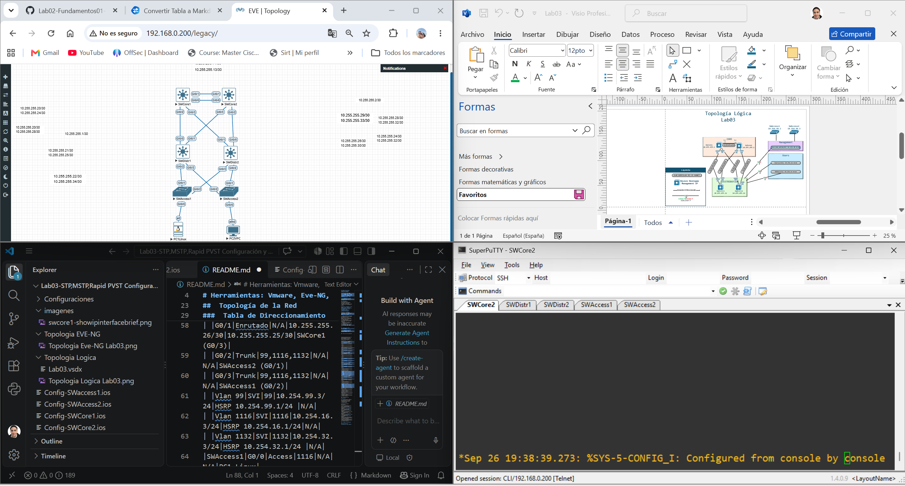

##  Descripción
git 

## Objetivo: Configurar la red, comprobar el comportamiento del trafico en una topología jerárquica, configurar y hacer troubleshooting de los protocolos utilizados.

Protocolos y Tecnologías trabajadas: Inter-Vlan Routing, FHRP: HSRP, Dynamic Routing: OSPF, Rapid PVST

1. Creamos nuestros scripts de configuración en Visual Studio para cada uno de los dispositivos y configuramos desde la Capa de Acceso hacia las capas superiores.
2. Encendemos equipos desde la Capa de Core hacia las capas inferiores.
3. Comprobamos configuraciones con comandos show.
4. Comprobamos comportamiento de Rapid PVST, OSPF y HSRP.

## Notas de campo

* En la topología tradicional de 3 capas se pueden usar varios diseños, en este caso se usa el diseño conmutado el cual la comunicación L3 se concentra entre capas de Core y Distribución a diferencia el diseño enrutado donde la comunicación L3 llega hasta la capa de acceso.
* Etherchannel: Empezamos por las interfaces físicas a agrupar en un portchannel y las apagamos primero, si el etherchannel es de L3 aplicamos no switchport , y luego aplicamos channel-group, de esta forma el Port Channel habrá recibido la configuración de las interfaces físicas y habremos evitado bucles en la creación de este.
* Las prioridades del protocolo HSRP o VRRP deben coincidir con el protocolo STP si estamos balanceando las VLANS, es decir ejemplo: si para SW1 esta activo el VIP del HSRP para vlan 10, entonces ese SW1 debe ser root primary STP para esa vlan.

---

##  Topología de la Red
Microsoft Visio

###  Tabla de Direccionamiento 

|Dispositivo|Interfaz|Tipo de Puerto|VLAN|Dirección IP / Máscara|Gateway / Next-Hop|Vecino/ Puerto Destino|
|:----|:----|:----|:----|:----|:----|:----|
|SWCore1|Loopback 0|Logico|N/A|10.255.255.1/32|N/A|N/A|
| |Po1|Enrutado|N/A|10.255.255.13/30|10.255.255.14/30|SWCore2 (Po1)|
| |G0/0|Po1|N/A|N/A|N/A|SWCore2 (G0/0)|
| |G0/1|Po1|N/A|N/A|N/A|SWCore2 (G0/1)|
| |G0/2|Enrutado|N/A|10.255.255.21/30|10.255.255.22/30|SWDistr1 (G0/0)|
| |G0/3|Enrutado|N/A|10.255.255.25/30|10.255.255.26/30|SWDistr2 (G0/1)|
|SWCore2|Loopback 0|Logico|N/A|10.255.255.2/32|N/A|N/A|
| |Po1|Enrutado|N/A|10.255.255.14/30|10.255.255.13/30|SWCore1 (Po1)|
| |G0/0|Po1|N/A|N/A|N/A|SWCore1 (G0/0)|
| |G0/1|Po1|N/A|N/A|N/A|SWCore1 (G0/1)|
| |G0/2|Enrutado|N/A|10.255.255.29/30|10.255.255.30/30|SWDistr2 (G0/0)|
| |G0/3|Enrutado|N/A|10.255.255.33/30|10.255.255.34/30|SWDistr1 (G0/1)|
|SWDistr1|Loopback 0|Logico|N/A|10.255.255.11/32|N/A|N/A|
| |G0/0|Enrutado|N/A|10.255.255.22/30|10.255.255.21/30|SWCore1 (G0/2)|
| |G0/1|Enrutado|N/A|10.255.255.34/30|10.255.255.33/30|SWCore2 (G0/3)|
| |G0/2|Trunk|99,1116,1132|N/A|N/A|SWAccess1 (G0/1)|
| |G0/3|Trunk|99,1116,1132|N/A|N/A|SWAccess2 (G0/2)|
| |Vlan 99|SVI|99|10.254.99.2/24|HSRP 10.254.99.1/24|N/A|
| |Vlan 1116|SVI|1116|10.254.16.2/24|HSRP 10.254.16.1/24|N/A|
| |Vlan 1132|SVI|1132|10.254.32.2/24|HSRP 10.254.32.1/24|N/A|
|SWDistr2|Loopback 0|Logico|N/A|10.255.255.12/32|N/A|N/A|
| |G0/0|Enrutado|N/A|10.255.255.30/30|10.255.255.29/30|SWCore2 (G0/2)|
| |G0/1|Enrutado|N/A|10.255.255.26/30|10.255.255.25/30|SWCore1 (G0/3)|
| |G0/2|Trunk|99,1116,1132|N/A|N/A|SWAccess2 (G0/1)|
| |G0/3|Trunk|99,1116,1132|N/A|N/A|SWAccess1 (G0/2)|
| |Vlan 99|SVI|99|10.254.99.3/24|HSRP 10.254.99.1/24 |N/A|
| |Vlan 1116|SVI|1116|10.254.16.3/24|HSRP 10.254.16.1/24|N/A|
| |Vlan 1132|SVI|1132|10.254.32.3/24|HSRP 10.254.32.1/24 |N/A|
|SWAccess1|G0/0|Access|1116|N/A|N/A|PC1 Linux|
| |G0/1|Trunk|99,1116,1132|N/A|N/A|SWDistr1 (G0/2)|
| |G0/2|Trunk|99,1116,1132|N/A|N/A|SWDistr2 (G0/3)|
|SWAccess2|G0/0|Access|1132|N/A|N/A|PC2 VPC|
| |G0/1|Trunk|99,1116,1132|N/A|N/A|SWDistr2 (G0/2)|
| |G0/2|Trunk|99,1116,1132|N/A|N/A|SWDistr1(G0/3)|

###  Configuración de dispositivos

Las configuraciones completas de cada dispositivo están disponibles en la carpeta [`configuraciones/`](./configuraciones):

|Dispositivo|Archivo|Descripción|
|:----|:----|:----|
|SWAccess1|[Config-SWaccess1.ios](./configuraciones/Config-SWaccess1.ios)|Config Completa|
|SWAccess2|[Config-SWaccess2.ios](./configuraciones/Config-SWaccess2.ios)|Config Completa|
|SWDistr1|[Config-SWDistr1.ios](./configuraciones/Config-SWDistr1.ios)|Config Completa|
|SWDistr2|[Config-SWDistr2.ios](./configuraciones/Config-SWDistr2.ios)|Config Completa|
|SWCore1|[Config-SWCore1.ios](./configuraciones/Config-SWCore1.ios)|Config Completa|
|SWCore2|[Config-SWCore2.ios](./configuraciones/Config-SWCore2.ios)|Config Completa|

###  Pruebas y Verificación

### Verificación de Configuración (show commands)

**Tablas de enrutamiento**

* Se han formado todas las adyacencias OSPF con exito y los neighbors se han distribuido las rutas correctamente.

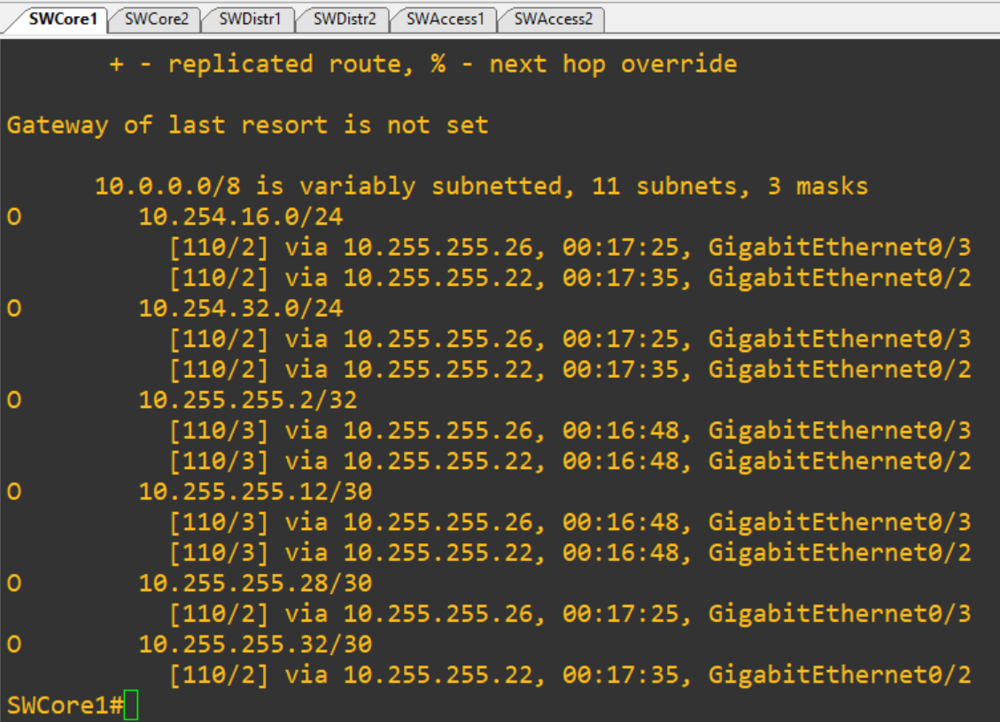
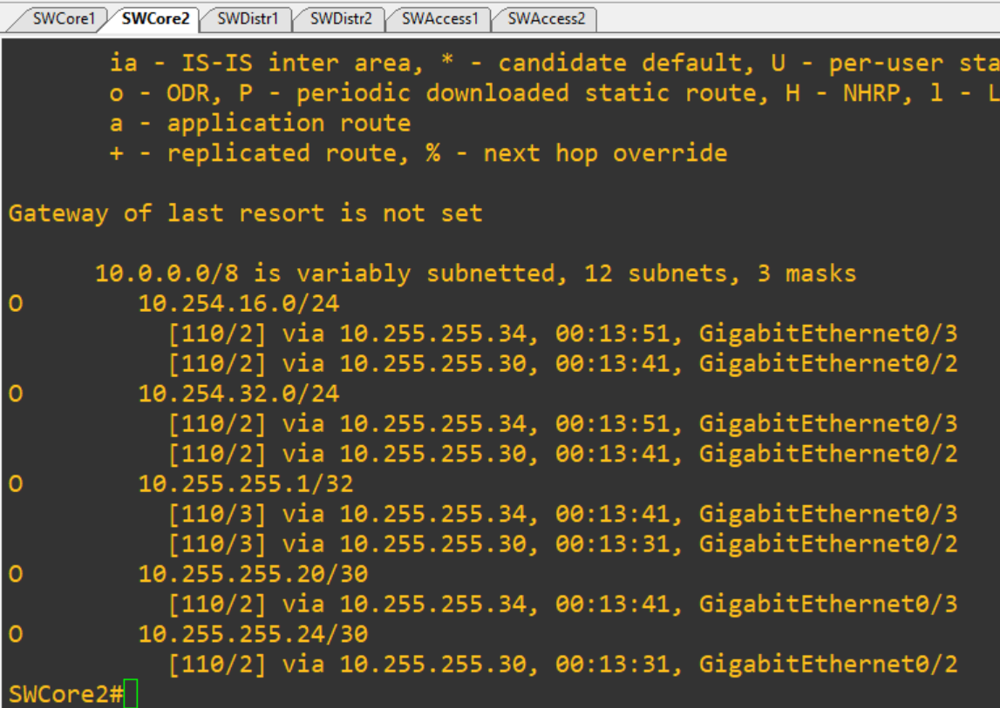

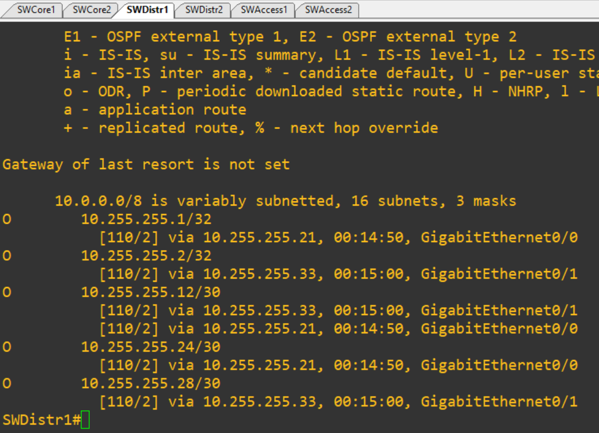
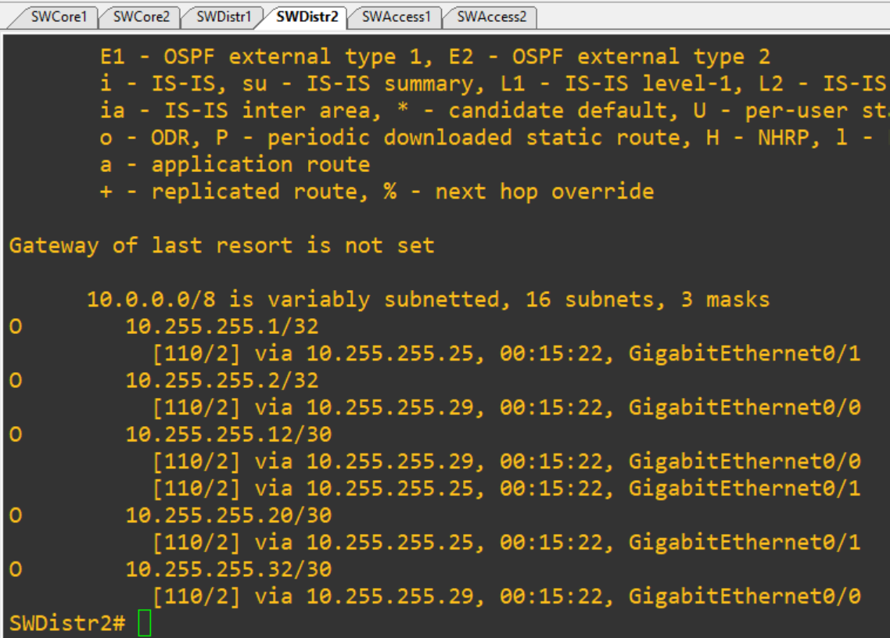

**Protocolo FHRP entre Switches de distribución**

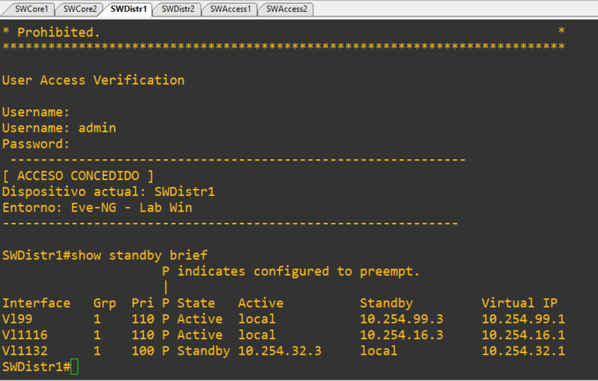
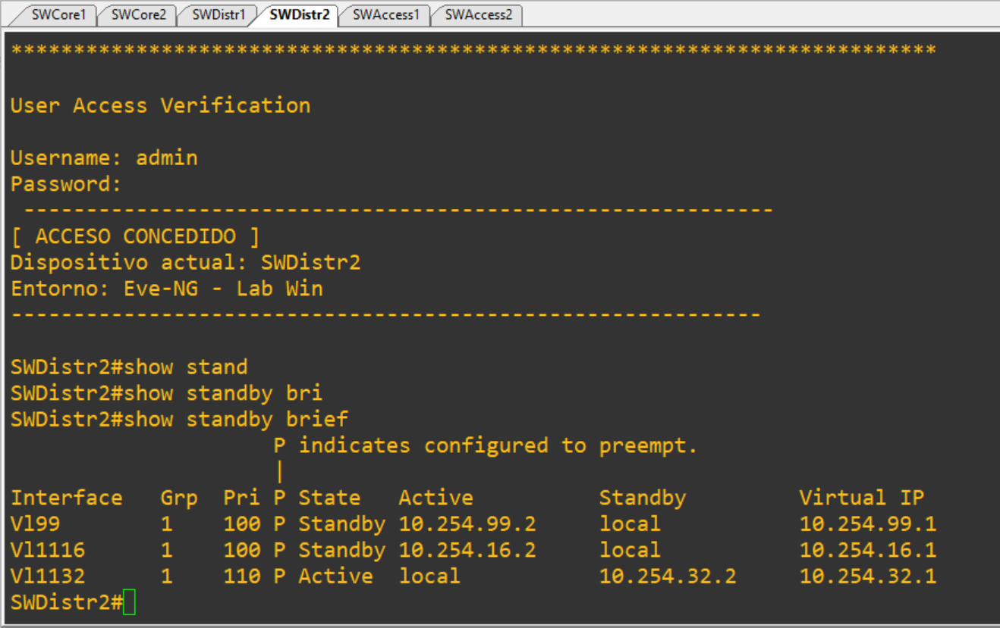

**Rapid PVST**

*Se puede verificar que VLANS estan bloqueadas y cuales en Forwarding de cada switch.

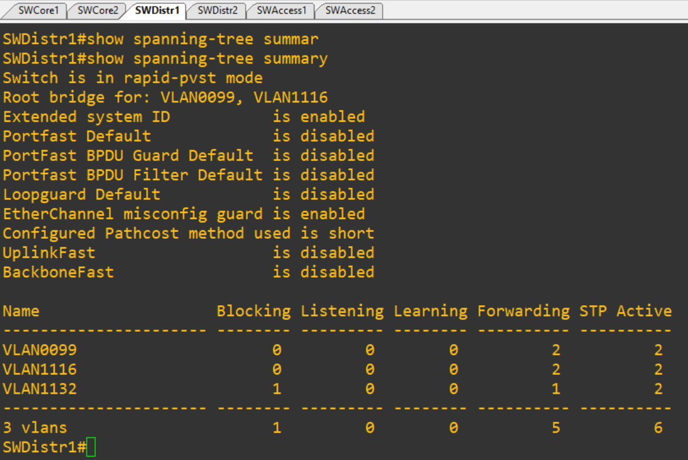
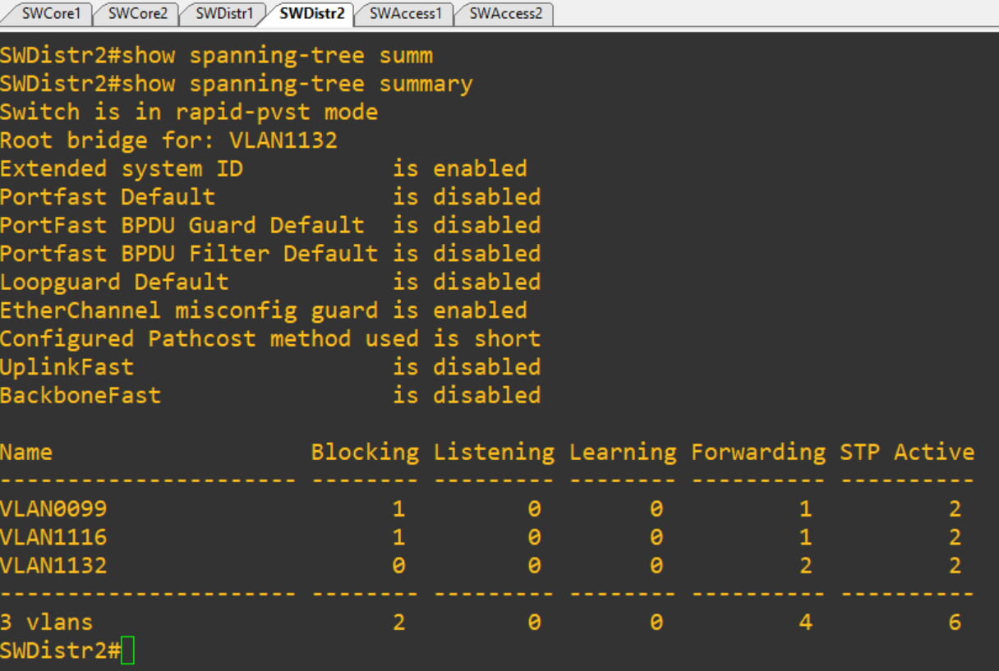

**OSPF Wireshark**

* Podemos observar el intervalo por defecto de 10 segundos del Hello de OSPF
* Observamos los intercambios de LSA al encender la topología.

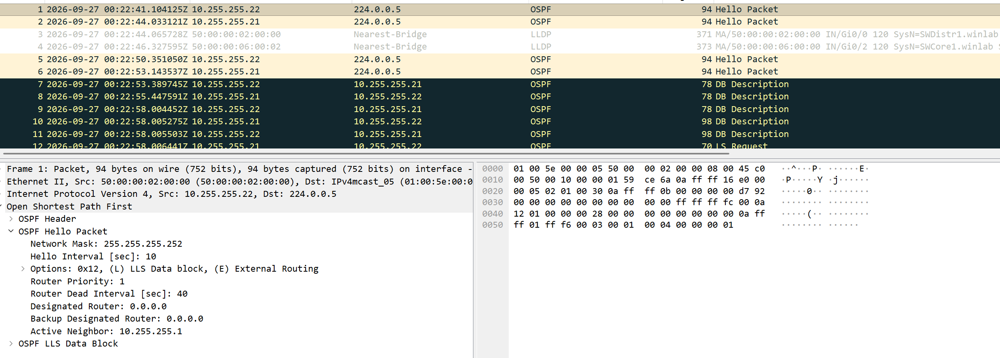

**PING desde PC1 Linux a PC VPC**

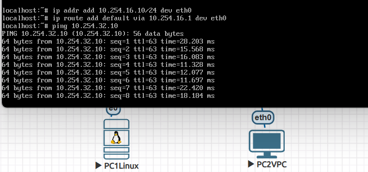

##  Skills Learned
- Configuración Intervlan
- Configuración de enrutamiento dinámico (OSPF)
- Configuración de protocolos de redundancia, disponibilidad y alta tolerancia (HSRP), (LACP), Etherchannel.
- Conocimiento de diseño tradicional de redes jerárquico
- Conocimiento y capacidad para Troubleshooting de OSPF, HSRP, LACP.